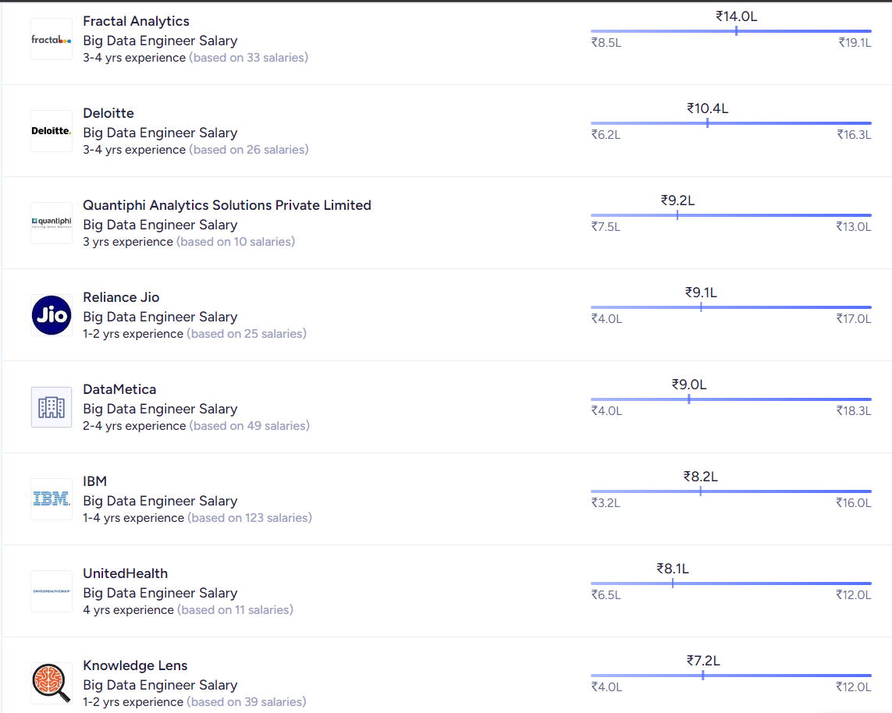
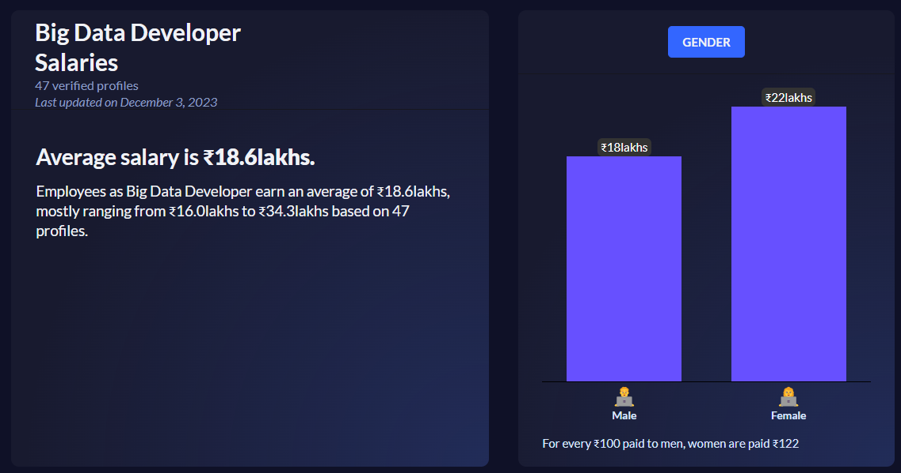
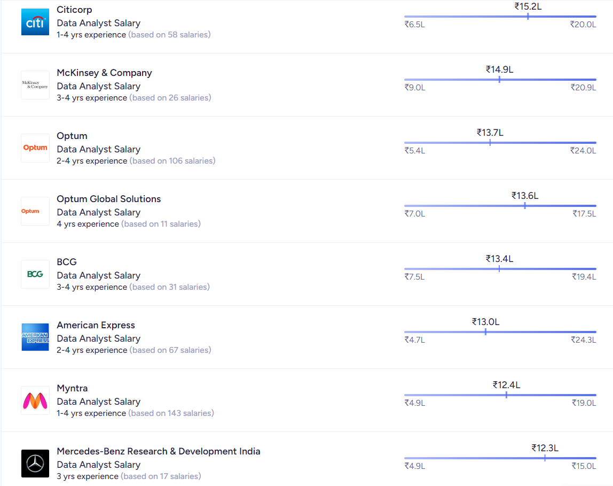
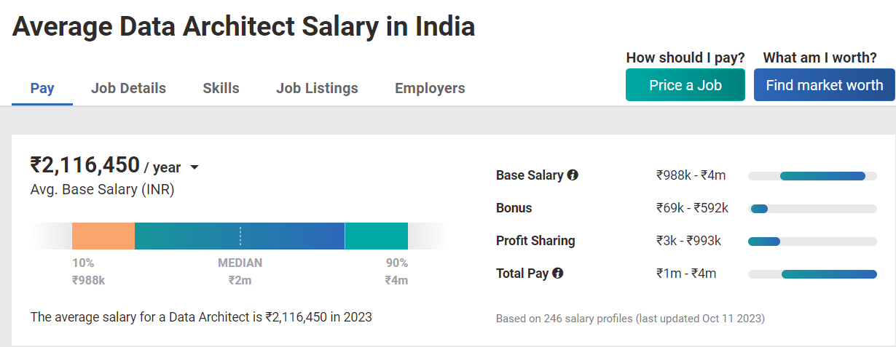
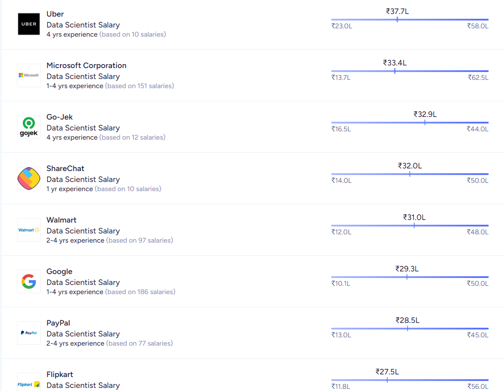
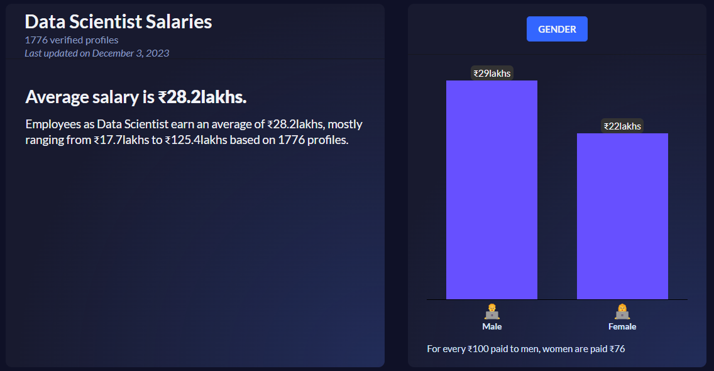
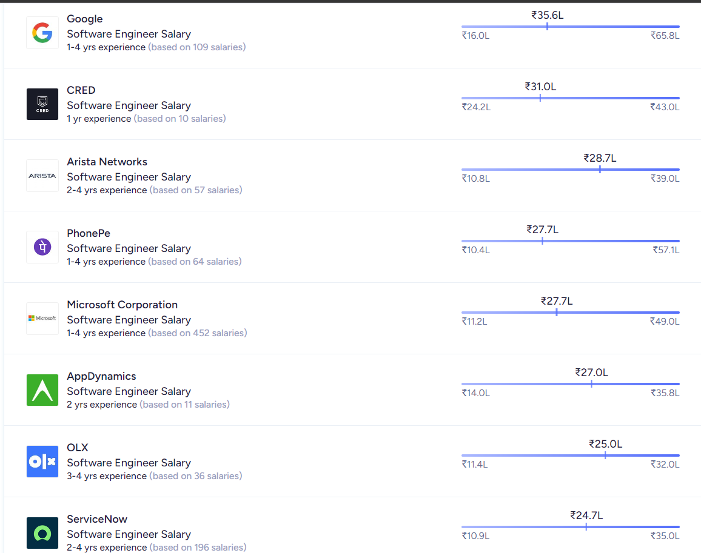
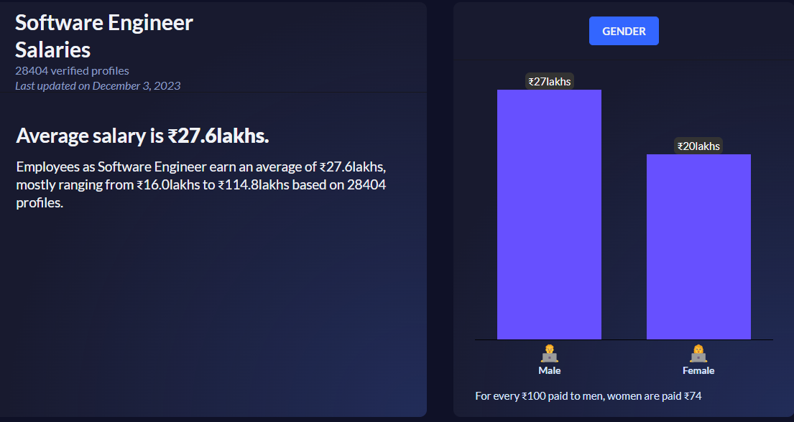
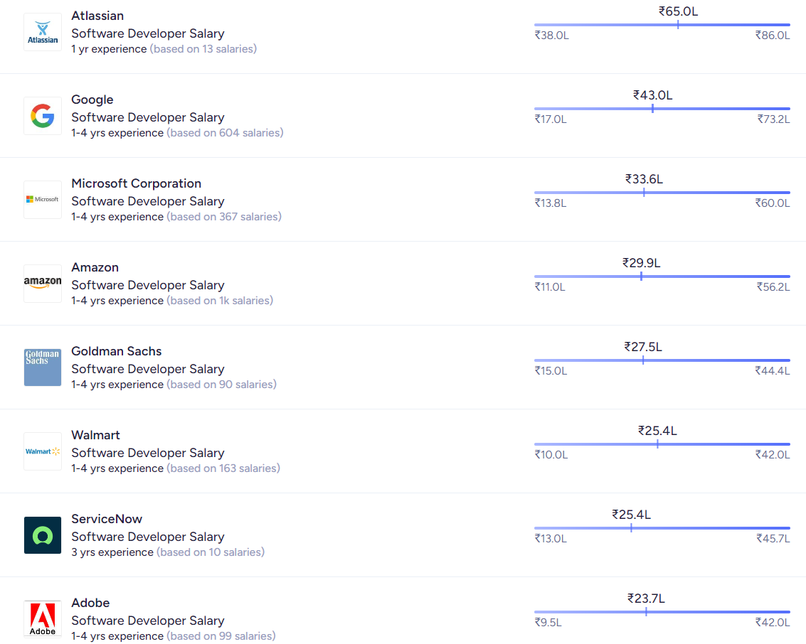
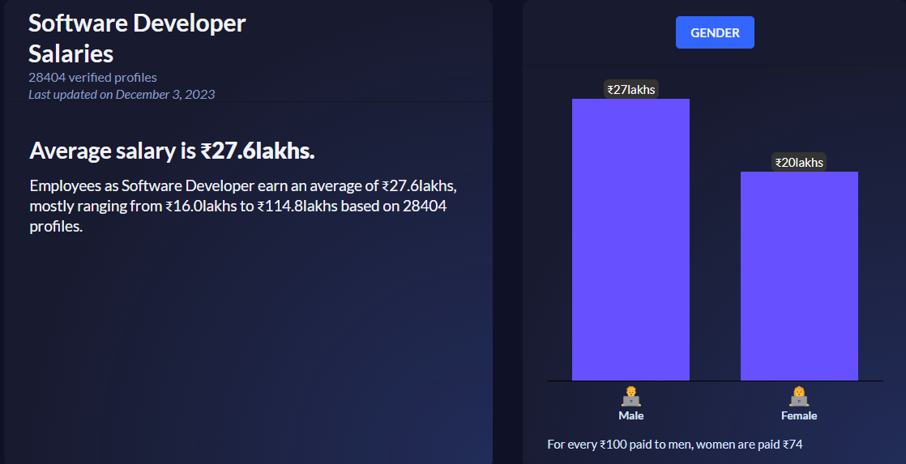

Big Data Engineer

The average salary for a Big Data Engineer in India is ₹9,28,477 per year. The average additional cash compensation is ₹86,906, with a range from ₹50,000 - ₹1,12,062.

Data Architect

Data Architect salary in India ranges between ₹ 14.0 Lakhs to ₹ 49.0 Lakhs with an average annual salary of ₹ 24.3 Lakhs. Salary estimates are based on 1.5k latest salaries received from Data Architects.

Data Scientist

As of September 2023, the average salary for a data scientist in India is ₹9,27,349 per year. The average monthly salary is ₹70,000 to ₹75,000. The entry-level salary is ₹5,77,893 per year

Software Engineer

The average salary for a software engineer in India is ₹5,17,000 gross per year, which is about ₹43,200 net per month. The starting salary for a software engineer is around ₹2,65,000 gross per year. The highest salary for a software engineer can reach and exceed ₹14,00,000 gross per year

Software Developer

The average salary for a software developer in India ranges from ₹1.9 Lakhs to ₹13.0 Lakhs, with an average annual salary of ₹7.4 Lakhs. The starting salary for a software developer is usually between ₹2.25 LPA and ₹2.85 LPA. The highest salary can go up to ₹15 LPA after gaining relevant experience, knowledge, and skills.

